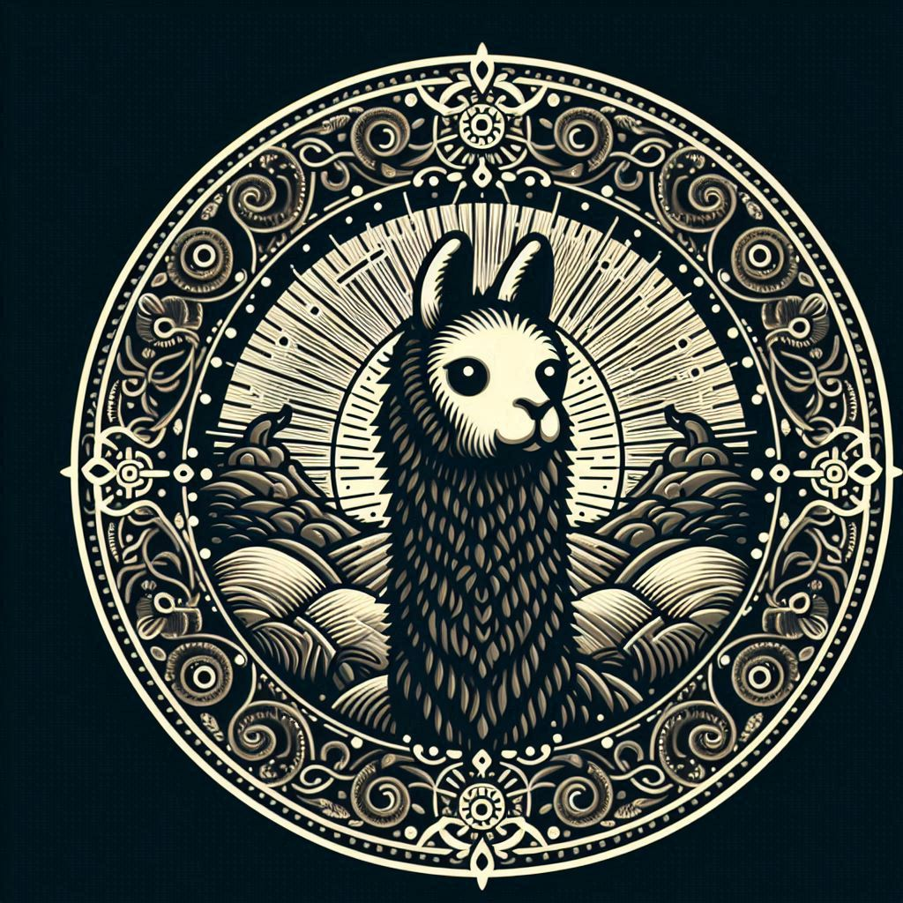

# rusty ollama

A Rust desktop chat app for talking to a locally running [Ollama](https://ollama.com/) model. It provides a native GUI (built with `egui`/`eframe`) where you type a message and get the model's reply in a chat-bubble interface. Requests are sent asynchronously to the local Ollama server (`http://localhost:11434`) using `reqwest` and `tokio`, with responses parsed via `serde`. Built with a focus on learning Rust GUI and async programming.

## Features

- Asynchronous HTTP requests using `reqwest`
- JSON parsing with `serde` and `serde_json`
- Comprehensive error handling
- Use of Rust's powerful type system and async/await syntax for clean and efficient code

## Dependencies

- `reqwest` for making HTTP requests
- `serde` and `serde_json` for JSON parsing
- `tokio` as the asynchronous runtime
- `futures-util` for additional utilities when working with futures
- `Ollama` Get the Ollama app for your operating system, and download the model you will be using

## Getting Started

To get started with "rusty ollama", ensure you have Rust and Cargo installed on your machine, and that [Ollama](https://ollama.com/) is running locally with the `llama3` model pulled (`ollama pull llama3`). Then clone this repository and build the crate, which lives in the `everything` directory.

```sh
git clone https://github.com/mbn-code/rusty-OLLAMA.git
cd rusty-OLLAMA/everything

cargo build
cargo run
```

# Purpose of the repository

The purpose of this repository is for you to have an easy setup for async integration of OLLAMA models in rust. 


### Contributing

Contributions are welcome! Please feel free to clone or fork the repository and open a pull-request.


This project is licensed under the MIT License - see the LICENSE file for details.

